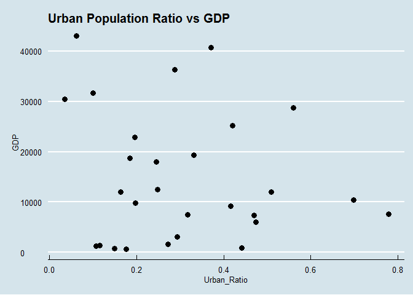

# HW12: Data from the Web
Santina Lin  
Friday, December 05, 2014  

# Goal
From our last week of STAT545, we learned about the amazing packages on ROpenSci through [in-class-demo](http://stat545-ubc.github.io/webdata02_activity.html) and how to [get data from the web](http://stat545-ubc.github.io/webdata03_activity.html) by reading the website. 

This is the [assignment](http://stat545-ubc.github.io/hw12_data-from-web). I will focus on : 
- combining two different datasets together
- comining different packages to make new things
- attempt to scrap data 


First let's load the housekeeping stuff: 

```r
# ==== Packages ====
library(ggplot2)    # for making plots
library(ggthemes)   # for customizaing ggplot graphs 
library(scales)     # for graphs scale
library(plyr)       # for easy computation with data frames
library(dplyr)      # do this after loading plyr
library(knitr)      # for rendering pretty tables
```

# Combine Gapminder and Geonames

First load the essentials for this section 


```r
# ==== Geonmaes package ====
#devtools::install_github("ropensci/geonames") 
options(geonamesUsername = "santina")
library(geonames)

# ==== Gapminder data ====
gdURL <- "http://tiny.cc/gapminder"
gapminder <- read.delim(file = gdURL) 
```

Now time to try answeirng Jenny's question: "What is the relationship between per-capita GDP and the proportion of the population which lives in urban centers?"
To answer this we need to know:
- the cities in each country, assuming urban population means people living in cities
- the population in those cities
- how many people live in the cities centers, in each country

## get a list of countries to investigate
To see a trend, we need that information for each country. I suspect that gapminder might have less data. Let's check. 

```r
nlevels(gapminder$country)
```

```
## [1] 142
```

```r
countryInfo <- GNcountryInfo()
summary(countryInfo)
```

```
##   continent           capital           languages        
##  Length:250         Length:250         Length:250        
##  Class :character   Class :character   Class :character  
##  Mode  :character   Mode  :character   Mode  :character  
##   geonameId            south            isoAlpha3        
##  Length:250         Length:250         Length:250        
##  Class :character   Class :character   Class :character  
##  Mode  :character   Mode  :character   Mode  :character  
##     north             fipsCode          population       
##  Length:250         Length:250         Length:250        
##  Class :character   Class :character   Class :character  
##  Mode  :character   Mode  :character   Mode  :character  
##      east            isoNumeric         areaInSqKm       
##  Length:250         Length:250         Length:250        
##  Class :character   Class :character   Class :character  
##  Mode  :character   Mode  :character   Mode  :character  
##  countryCode            west           countryName       
##  Length:250         Length:250         Length:250        
##  Class :character   Class :character   Class :character  
##  Mode  :character   Mode  :character   Mode  :character  
##  continentName      currencyCode      
##  Length:250         Length:250        
##  Class :character   Class :character  
##  Mode  :character   Mode  :character
```
Indeed we see that gapminder has less countries. Also all the entry in countryInfo are characters.

Since we need information from both gapminder and the information from `geonames` packages, we'll use the countries with information in both. 


```r
common_countries <- intersect(gapminder$country, countryInfo$countryName)
length(common_countries)
```

```
## [1] 28
```
There are only 28 of them! What are they? 

```r
common_countries
```

```
##  [1] "Bangladesh"               "Bosnia and Herzegovina"  
##  [3] "Burkina Faso"             "Canada"                  
##  [5] "Central African Republic" "Czech Republic"          
##  [7] "Dominican Republic"       "France"                  
##  [9] "Gambia"                   "Hungary"                 
## [11] "Ireland"                  "Jamaica"                 
## [13] "Japan"                    "Lebanon"                 
## [15] "Libya"                    "Malaysia"                
## [17] "Mexico"                   "Mongolia"                
## [19] "Montenegro"               "New Zealand"             
## [21] "Puerto Rico"              "Reunion"                 
## [23] "Sao Tome and Principe"    "Serbia"                  
## [25] "Slovak Republic"          "Somalia"                 
## [27] "Taiwan"                   "United States"
```
So these are the countries we'll look at. It might have been due to spelling or spacing that some countries were picked out. 

## Find urban population in these countries 

We'll write a function to find the total urban population in these countries. 

```r
urbanPopulation <- adply(common_countries, .margins = 1, function(country){
  # filter the countryInfo by the country
  sub <- countryInfo %>%
    filter(countryName == country)
  # use the information of coordinates to get cities in that area
  cities <- GNcities(north = sub$north, east = sub$east, 
                     south = sub$south, west = sub$west)
  # further filter the cities to make sure they belong to the country we're looking at
  # notice "countrycode" vs "countryCode"
  cities <- cities %>% filter(countrycode == sub$countryCode) 
  
  #sum the population and store the information in a list to be bind into a dataframe
  totalPopulation <- sum(as.numeric(cities$population))
  result <- c(country, totalPopulation)
  
}) 
head(urbanPopulation)
```

```
##   X1                       V1       V2
## 1  1               Bangladesh 17389306
## 2  2   Bosnia and Herzegovina  1443873
## 3  3             Burkina Faso  1533958
## 4  4                   Canada  9626685
## 5  5 Central African Republic   768061
## 6  6           Czech Republic  2012408
```
Oh guess what, I wrote that `adply()` from scratch in one shot and code compiled on the first try. Yeah look at my R programming muscles I got from lifting homework and peer reviews every week. 

Fixing up the data frame: 

```r
# take out the first column 
urbanPopulation <- urbanPopulation[, c(2,3)]
colnames(urbanPopulation) <- c("Country", "Urban_Population")
head(urbanPopulation)
```

```
##                    Country Urban_Population
## 1               Bangladesh         17389306
## 2   Bosnia and Herzegovina          1443873
## 3             Burkina Faso          1533958
## 4                   Canada          9626685
## 5 Central African Republic           768061
## 6           Czech Republic          2012408
```

##Combine gapminder and the urban data set

Now let's bind more information from gapminder to this data frame. 

```r
gapminder_sub <- gapminder %>% 
  subset(country %in% common_countries) %>%
  subset(year == 2007)
  
urbanPopulation <- cbind(urbanPopulation, gapminder_sub$pop, gapminder_sub$gdpPercap)

# fix up the column names 
colnames(urbanPopulation) <- c("Country", "Urban_Population", "Total_Population", "GDP")
summary(urbanPopulation)
```

```
##    Country          Urban_Population   Total_Population         GDP       
##  Length:28          Length:28          Min.   :   199579   Min.   :  706  
##  Class :character   Class :character   1st Qu.:  3937188   1st Qu.: 5293  
##  Mode  :character   Mode  :character   Median :  7577844   Median :11219  
##                                        Mean   : 33530207   Mean   :14963  
##                                        3rd Qu.: 23586042   3rd Qu.:23421  
##                                        Max.   :301139947   Max.   :42952
```
The field for urban population is seemed as charcaters so we'll change that. 


```r
urbanPopulation$Urban_Population  <- as.numeric(urbanPopulation$Urban_Population)
summary(urbanPopulation)
```

```
##    Country          Urban_Population   Total_Population         GDP       
##  Length:28          Min.   :   54456   Min.   :   199579   Min.   :  706  
##  Class :character   1st Qu.: 1230566   1st Qu.:  3937188   1st Qu.: 5293  
##  Mode  :character   Median : 2008002   Median :  7577844   Median :11219  
##                     Mean   : 4683799   Mean   : 33530207   Mean   :14963  
##                     3rd Qu.: 4855128   3rd Qu.: 23586042   3rd Qu.:23421  
##                     Max.   :18890532   Max.   :301139947   Max.   :42952
```

```r
head(urbanPopulation)
```

```
##                    Country Urban_Population Total_Population        GDP
## 1               Bangladesh         17389306        150448339  1391.2538
## 2   Bosnia and Herzegovina          1443873          4552198  7446.2988
## 3             Burkina Faso          1533958         14326203  1217.0330
## 4                   Canada          9626685         33390141 36319.2350
## 5 Central African Republic           768061          4369038   706.0165
## 6           Czech Republic          2012408         10228744 22833.3085
```

##Calculate the urban ratio and its relationship with GDP

Now we just need an extra column for the urban population raio 

```r
ratios <- ddply(urbanPopulation, ~Country, function(data){
  ratio <- (data$Urban_Population)/(data$Total_Population)
})

head(ratios)
```

```
##                    Country        V1
## 1               Bangladesh 0.1155832
## 2   Bosnia and Herzegovina 0.3171815
## 3             Burkina Faso 0.1070736
## 4                   Canada 0.2883092
## 5 Central African Republic 0.1757964
## 6           Czech Republic 0.1967405
```

```r
colnames(ratios) <- c("Country", "Urban_Ratio")
urbanPopulation_Ratio_GDP <- cbind(urbanPopulation, "Urban_Ratio" = ratios$Urban_Ratio)
```

Now we can graph to see if there's any relationship


```r
ggplot(urbanPopulation_Ratio_GDP, aes(x=Urban_Ratio, y=GDP)) + 
  geom_point(size=3) +
  ggtitle("Urban Population Ratio vs GDP") + 
  theme_economist()
```

 
Haha doesn't seem very correlated at all. There are some factors that have an effect on the analysis, such as how we define "urban" in this analysis, the information regarding to urban population (we don't know which year it is from), etc. 


# Combine Rplos and rebirds 
Now I'm interesting in knowing about the number of publications on birds. To do that, the easiest way is to get a list of birds and then use `rplos::plosword`, which allow you to search multiple terms at once and return the number of publications for each, with the options to view that result in a histogram. 

Pacakges involved: [rbirds](https://github.com/ropensci/rebird) and [rplos](https://github.com/ropensci/rplos)

Let's try searching for birds in Canada. 

```r
library(rplos)
```

```
## 
## 
##  New to rplos? Tutorial at http://ropensci.org/tutorials/rplos_tutorial.html. Use suppressPackageStartupMessages() to suppress these startup messages in the future
```

```r
library(rebird)
birds_Canada <- ebirdregion(region = 'CA')
head(birds_Canada)
```

```
##                   comName howMany      lat        lng    locID
## 1            Common Raven       2 50.44700 -104.54915 L2401002
## 2             Rock Pigeon       2 50.44700 -104.54915 L2401002
## 3          Trumpeter Swan       3 43.27071  -79.87181 L1064091
## 4 Great Black-backed Gull      35 43.27071  -79.87181 L1064091
## 5       Red-throated Loon       1 43.27071  -79.87181 L1064091
## 6         Red-tailed Hawk       1 43.27071  -79.87181 L1064091
##                                       locName locationPrivate
## 1 Regina--Victoria Ave. & University Park Dr.            TRUE
## 2 Regina--Victoria Ave. & University Park Dr.            TRUE
## 3                     Hamilton--Bayfront Park           FALSE
## 4                     Hamilton--Bayfront Park           FALSE
## 5                     Hamilton--Bayfront Park           FALSE
## 6                     Hamilton--Bayfront Park           FALSE
##              obsDt obsReviewed obsValid           sciName
## 1 2014-12-03 16:25       FALSE     TRUE      Corvus corax
## 2 2014-12-03 16:25       FALSE     TRUE     Columba livia
## 3 2014-12-03 16:20       FALSE     TRUE Cygnus buccinator
## 4 2014-12-03 16:20       FALSE     TRUE     Larus marinus
## 5 2014-12-03 16:20       FALSE     TRUE    Gavia stellata
## 6 2014-12-03 16:20       FALSE     TRUE Buteo jamaicensis
```

```r
length(unique(birds_Canada$sciName))
```

```
## [1] 365
```
There are so many types of birds!  Maybe if I study one bird each day for a year, then I'll get to know all the bird species in Canada. Okay back to the topic: 

Let's search the number of publications


```r
# this line takes a long time to run
numb_publications <- plosword(birds_Canada$sciName)

head(numb_publications)
```

```
##   No_Articles              Term
## 1          68      Corvus corax
## 2         193     Columba livia
## 3           2 Cygnus buccinator
## 4          21     Larus marinus
## 5           7    Gavia stellata
## 6          21 Buteo jamaicensis
```

```r
max_numb <- max(numb_publications$No_Articles)
numb_publications[numb_publications$No_Articles == max_numb, ]
```

```
##     No_Articles      Term
## 270      132832 Alle alle
```
So as it turns out the bird "Alle alle" is mentioned most frequently, in 132832 papers! It's also call "Little Auk", here's how it looks: 
![Little Auk]


```r
nrow(numb_publications[numb_publications$No_Articles == 0, ])
```

```
## [1] 33
```

And there are still that many birds that we know nothing about (with zero publications on them).

# Aiming higher: trying other packages
Since we just looked at a bird package, it's fair to look at another, [AntWeb](http://ropensci.org/tutorials/antweb_tutorial.html)

First get the package: 

```r
#install_github("ropensci/AntWeb")
library(AntWeb)
```

And then explore the funtionalities.... by reading the description, it seems like the package is very scientific...meanning that a lot of time you'd have to search by the name of the species, unlike in the case of rbird when we can have many search options. However, there's a option to search by location. 

```r
vancouver_ants <- aw_coords(coord = "49.25,-123.1", r = 2) # in 2 km radius
class(vancouver_ants)
```

```
## [1] "antweb"
```

```r
vancouver_ants
```

```
## [Total results on the server]: 0 
## [Args]: 
## coord = 49.25,-123.1 
## r = 2 
## NULL
```
Cool! I didn't think you can create your own data type. Unfortunately, there's no record.


Let's try searching by a species name. The only ants I know are the leaf-cutting ants, and one of the species is called "Atta cephalotes" (thanks, wikipedia, and I donated)

```r
# search for availble records on leaf cutters
leaf_cutter <- aw_data(genus = "atta")
```

```
## 792 results available for query.
```

```r
#792 results available for query. 
leaf_cutter
```

```
## [Total results on the server]: 792 
## [Args]: 
## genus = atta 
## [Dataset]: [792 x 16] 
## [Data preview] :
##                                                               url
## 1    http://antweb.org/api/v2/?occurrenceId=CAS:ANTWEB:alas378391
## 2 http://antweb.org/api/v2/?occurrenceId=CAS:ANTWEB:casent0003277
##   catalogNumber     family  subfamily genus specificEpithet
## 1    alas378391 formicidae myrmicinae  Atta      cephalotes
## 2 casent0003277 formicidae myrmicinae  Atta           indet
##   scientific_name typeStatus stateProvince    country dateIdentified
## 1 atta cephalotes                  Heredia Costa Rica     2004-01-01
## 2      atta indet                                Peru     2000-11-10
##     habitat minimumElevationInMeters geojson.type decimal_latitude
## 1                                 50        point        10.436055
## 2 Rio Heath                       NA        point        -12.83333
##   decimal_longitude
## 1         -84.01153
## 2         -68.83333
```

```r
aw_map(leaf_cutter)
```

```
## 
## File saved under C:/Users/SANTIN~1/AppData/Local/Temp/RtmpC2ZBW0/temp.geojson
## 
## Your leaflet map has been saved under C:/Users/SANTIN~1/AppData/Local/Temp/RtmpC2ZBW0/AntWeb_species_map/AntWeb_species_map.html
```
Running the last line of code prompted a browser to open and show a map of where the ants have been found. Such interation with the data, especially when stepping outside of data frame and R studio, is really cool! 

Map picture : 
![Little Auk]
or [view the interactive map](AntWeb species map.html) 


# Reflection
I thought the exploration was very interesting. Being able to get data from various sources and generate new knowledge by combining them seem to be my additional step toward becoming a better data scientist. 

I didn't have the  time to explore the web scrapping aspect of the assignment. So that's something I would like to do in the future. Also I came across some visualization packages that involve web technology. I am curious as to how R package can invoke javascript. I'd be interesting to see how packagess like [Togeojson](https://github.com/ropensci/togeojson) work. I was gonna try out [rMaps](https://github.com/ropensci/rMaps) but couldn't understand how to bind additional data to it. When I have time, I want to understand how geojson files work. 

Another thing worth noting is that Rplos requires the API key, so I had to move this Rmarkdown file into the project where Rplos key has been saved in the .Rprofile. After that, within this project, I compile this .Rmd and then move it and its associated files to the course project, and commit it there. I guess in the real situaiton I would just set the .Rprofile in my course project and then before not to add it to github. 
