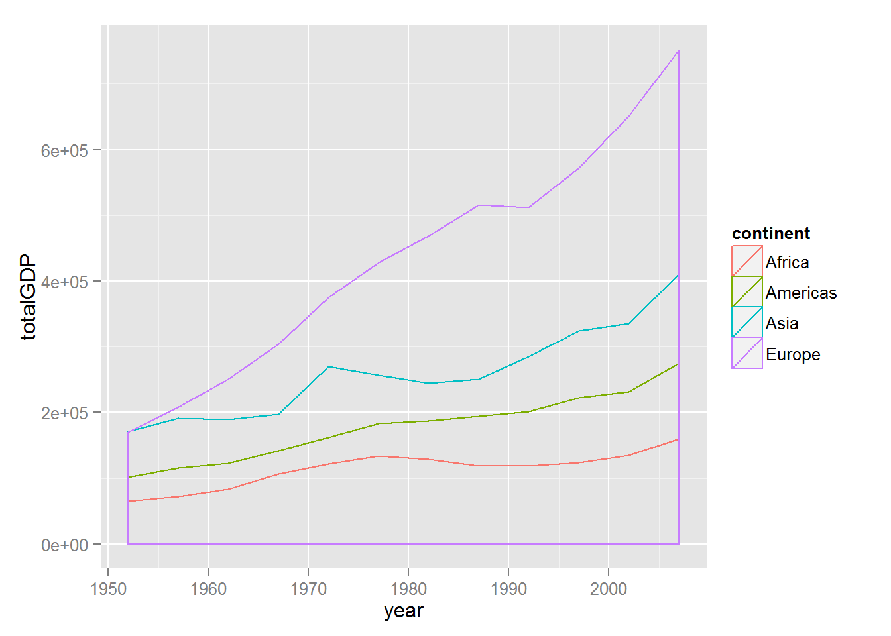

# Explorating ggplot2
Santina  
Monday, September 29, 2014  

(since github doesn't render graphs from R, so I have manually added them in the markdown)

In this R markdown I'm going to try out some ggplot2 features I just learned from Prof. Jenny Bryan's [tutorial](https://github.com/jennybc/ggplot2-tutorial) on the [gapminder data](http://www.stat.ubc.ca/~jenny/notOcto/STAT545A/examples/gapminder/data/gapminderDataFiveYear.txt) like in the last Rmd assignment. 

First let's see what variables we can play with: 


```r
#load ggplot2 and dplyr, which we will used later
library(ggplot2) 
```

```
## Warning: package 'ggplot2' was built under R version 3.1.1
```

```r
suppressPackageStartupMessages(library(dplyr))
```

```
## Warning: package 'dplyr' was built under R version 3.1.1
```

```r
#load gapminder data 
gdURL <- "http://tiny.cc/gapminder"
data <- read.delim(file = gdURL) 
str(data)
```

```
## 'data.frame':	1704 obs. of  6 variables:
##  $ country  : Factor w/ 142 levels "Afghanistan",..: 1 1 1 1 1 1 1 1 1 1 ...
##  $ year     : int  1952 1957 1962 1967 1972 1977 1982 1987 1992 1997 ...
##  $ pop      : num  8425333 9240934 10267083 11537966 13079460 ...
##  $ continent: Factor w/ 5 levels "Africa","Americas",..: 3 3 3 3 3 3 3 3 3 3 ...
##  $ lifeExp  : num  28.8 30.3 32 34 36.1 ...
##  $ gdpPercap: num  779 821 853 836 740 ...
```

So we have country, continent, pop (population), gdpPercap, lifeExp, and year. That's plenty to work with. Since lifeExp has been explored quite throroughly in the tutorial, I'll focus on other variables. 

Also, there are only 2 countries in Oceania so I will exclude them from further analysis. 


```r
data  <- subset(data, continent != "Oceania")
```

#Population Boom
I'm interested to find out the trend of the population growth globally 

So we need to break down the problem step by step.  
- sum population of all countries by year 
- construct a smooth histogram 

##Global Population
Sounds like a daunting task... take a moment to think what'd be a smart way to sum population by continent? 
...
Ans: use the %>% to pipe and filter and summarize! 

```r
population_year  <-  data %>% group_by(year) %>% 
    summarize(million = sum(pop)/1000000) 

head(population_year, 10)
```

```
## Source: local data frame [10 x 2]
## 
##    year million
## 1  1952    2396
## 2  1957    2652
## 3  1962    2886
## 4  1967    3203
## 5  1972    3561
## 6  1977    3913
## 7  1982    4271
## 8  1987    4672
## 9  1992    5090
## 10 1997    5493
```

Now we graph it 

```r
ggplot(data=population_year, aes(x=year, y=million)) + 
  geom_histogram(stat="identity", alpha=0.5)
```

 


Note that we need to specify `stat = "identity"` because we have pre-tabulated, i.e. the heights (population in millions) are already calculated. 

## Population by Continent 
Let's try adding more information, supposed we want to see how much each continent contributes to the total population... 


```r
#create a new data.frame with total population sorted by year and continent
population_continent  <-  data %>% group_by(year, continent) %>% 
  summarize(million = sum(pop)/1000000) 

#make a smooth graph, color by continent
ggplot(data=population_continent, 
  aes(x = year, y = million, color = continent)) + 
  geom_density(stat="identity", alpha=0.6)
```

 


Looks like Asia contributes to the most... to double check, let's use a bit more R trick 


```r
population_continent  %>% 
  filter(continent=="Asia")  %>% 
  arrange(desc(year))
```

```
## Source: local data frame [12 x 3]
## Groups: year
## 
##    year continent million
## 1  2007      Asia    3812
## 2  2002      Asia    3602
## 3  1997      Asia    3383
## 4  1992      Asia    3133
## 5  1987      Asia    2871
## 6  1982      Asia    2610
## 7  1977      Asia    2385
## 8  1972      Asia    2151
## 9  1967      Asia    1906
## 10 1962      Asia    1696
## 11 1957      Asia    1563
## 12 1952      Asia    1395
```

Indeed we see that in 2007 the population in Asia was close to 4000 millions. 

#The Wealth of the World 

I'm now curious to see the growth (supposedly) of the total wealth measured by gdpPercap in the world. 


##GDP per capita by year 
Using the same technique with the population, let's first visualize the trend of the wealth and how much each continent contributes to the total wealth. 


```r
#create a new data.frame with total population sorted by year and continent
wealth_continent  <-  data %>% 
  group_by(year, continent) %>% 
  summarize(totalGDP = sum(gdpPercap)) 


#make a smooth graph, color by continent
ggplot(data=wealth_continent, 
       aes(x = year, y = totalGDP, color = continent)) + 
  geom_density(stat="identity", alpha=0.6)
```

 


We see that Europe has the most combined wealth in the recorded years. 


##Wealth gap by year 

Now I'm curious to see the wealth gap by year... whether it increases, decreases, or fluctuates throughout the recorded years. To do that, we'll draw box graphs with raw data layed on top to see range, median, mean, and all that.  


```r
#(in order) create box plot and layer dots of raw data and then customize the title and theme
library(ggthemes) 
```

```
## Warning: package 'ggthemes' was built under R version 3.1.1
```

```r
ggplot(data, aes(x = year, y = gdpPercap))+
  geom_boxplot(aes(group = year)) +
  geom_jitter(position = position_jitter(width = 0.1, height = 0), alpha = 1/4) +
  ggtitle("Wealth Gap") + theme_economist()
```

 


Sadly the wealth cap is extremely large especially in the 1950 to 1980s. There are some really wealthy countries in the mid 1900 but they seem to disappeared toward 2000. To take a glimpse of what they are: 


```r
# to see the richest countries in 1950s (earliest year is 1952)
head(data  %>% select(year, country, gdpPercap) %>% 
       filter(year == 1952)  %>% arrange(desc(gdpPercap)))
```

```
##   year        country gdpPercap
## 1 1952         Kuwait    108382
## 2 1952    Switzerland     14734
## 3 1952  United States     13990
## 4 1952         Canada     11367
## 5 1952         Norway     10095
## 6 1952 United Kingdom      9980
```

```r
# see the richest countries in 2007 
head(data  %>% select(year, country, gdpPercap) %>% 
       filter(year == 2007)  %>% arrange(desc(gdpPercap)))
```

```
##   year          country gdpPercap
## 1 2007           Norway     49357
## 2 2007           Kuwait     47307
## 3 2007        Singapore     47143
## 4 2007    United States     42952
## 5 2007          Ireland     40676
## 6 2007 Hong Kong, China     39725
```

Woah, Kuwait used to be very rich! According to the [wikipedia article](http://en.wikipedia.org/wiki/Kuwait#Economic_prosperity): 
"In 1951, a major public-work programme began to enable Kuwaitis to enjoy a better standard of living. By 1952, the country became the largest exporter of oil in the Persian Gulf region.......In the 1980s, there were many terror attacks in Kuwait..." 

##a little reflection 
During the graphing process, I had a lot of trouble graphing a dataframe that I created myself. After hours of frustration (and having to go outside for breaks twice) and reading some [stack overflow posts](http://stackoverflow.com/questions/15651084/ggplot2-mapping-variable-to-y-and-using-stat-bin), I finally realize that ggplot2 has this strange habit of trying to tabulated your data. So if you have pretabulate it you need to use `stat = "identity"` 

Lastly, it's interesting to see how data can reflect the real life events. By going through the ggplot2 tutorials, I learned a lot today. (ready to beome a better R ninja!)

