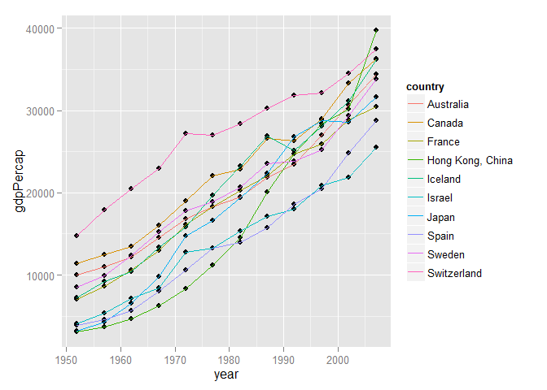
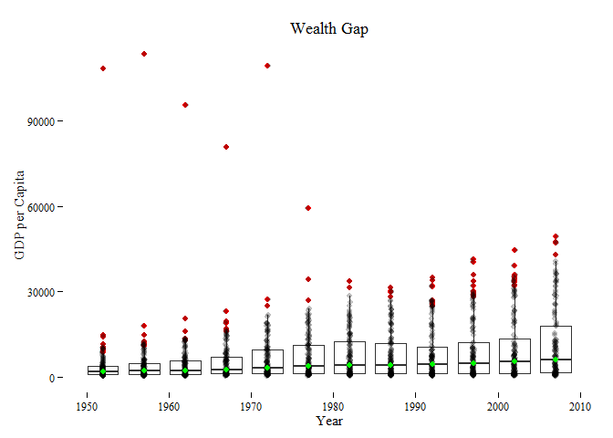
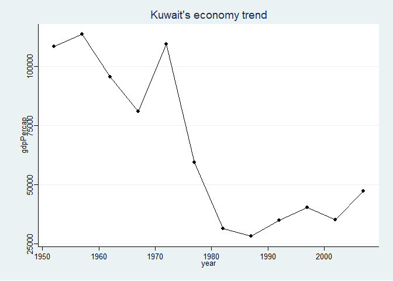

# HW4: plyr, deplyr, gapminder
Santina  
Monday, October 5, 2014  

#Exploration with plyr 

##Brief info 
This homework will reply on the stuff I learned about (links to tutorials) 
- [R functions](http://stat545-ubc.github.io/block011_write-your-own-function-01.html)
- [dply](http://stat545-ubc.github.io/block010_dplyr-end-single-table.html) and [plyr](http://stat545-ubc.github.io/block013_plyr-ddply.html), the ways to  
- [linear regression](http://stat545-ubc.github.io/block012_function-regress-lifeexp-on-year.html) 
- [ggplot2] (https://github.com/jennybc/ggplot2-tutorial), of course. 

Also, I have taken a lot of [notes on R](https://github.com/santina/programmerNotes) for not just those tutorials, but also all the topics covered so far as well as those in swirl. 

The objectives will be based on the [outline](http://stat545-ubc.github.io/hw04_write-function-use-plyr.html) on the stats545 website.

**The mission is to further explore the gapminder data with the new techniques (plyr, R functions)** 

##Load the libraries and data 

First load the needed libraries

```r
library(ggplot2) # for making plots
library(ggthemes)# for customizaing ggplot graphs 
library(scales)  # for graphs scale
library(plyr)    # for easy computation with data frames
library(dplyr) 
```

```
## 
## Attaching package: 'dplyr'
## 
## The following objects are masked from 'package:plyr':
## 
##     arrange, desc, failwith, id, mutate, summarise, summarize
## 
## The following objects are masked from 'package:stats':
## 
##     filter, lag
## 
## The following objects are masked from 'package:base':
## 
##     intersect, setdiff, setequal, union
```

```r
suppressPackageStartupMessages(library(dplyr))
library(knitr)   # for rendering pretty tables
library(tidyr)
```

And then the data :  "data"

```r
#load gapminder data 
gdURL <- "http://tiny.cc/gapminder"
data <- read.delim(file = gdURL) 
str(data)
```

```
## 'data.frame':	1704 obs. of  6 variables:
##  $ country  : Factor w/ 142 levels "Afghanistan",..: 1 1 1 1 1 1 1 1 1 1 ...
##  $ year     : int  1952 1957 1962 1967 1972 1977 1982 1987 1992 1997 ...
##  $ pop      : num  8425333 9240934 10267083 11537966 13079460 ...
##  $ continent: Factor w/ 5 levels "Africa","Americas",..: 3 3 3 3 3 3 3 3 3 3 ...
##  $ lifeExp  : num  28.8 30.3 32 34 36.1 ...
##  $ gdpPercap: num  779 821 853 836 740 ...
```

#Asking hard questions 

Here I will attempt to challenge myself with some hard questions and use plyr, dplyr and some basic R techniques to solve the questions. Like many people, I like to ask about what's the most/least and what's the trend of something over time.  

With the variables in the gapminder data in mind, I'd like to find out **Which of the top 10 countries with the highest lifeExp in 2007 experience the greatest growth in GDP per capital?** 

First we need to find out what are those 10 countries 

```r
topTen  <- 
  data %>%
  select(country, lifeExp, year) %>%
  arrange(desc(lifeExp)) %>%
  filter(year==2007) %>%
  filter(min_rank(desc(lifeExp)) < 11)

kable(topTen)
```


|country          | lifeExp| year|
|:----------------|-------:|----:|
|Japan            |   82.60| 2007|
|Hong Kong, China |   82.21| 2007|
|Iceland          |   81.76| 2007|
|Switzerland      |   81.70| 2007|
|Australia        |   81.23| 2007|
|Spain            |   80.94| 2007|
|Sweden           |   80.88| 2007|
|Israel           |   80.75| 2007|
|France           |   80.66| 2007|
|Canada           |   80.65| 2007|
Originally I  had `select(country, lifeExp, year==2007)` and `filter(min_rank(lifeExp) < 11)`. These codes won't work because we cannot specify the value inside `select` and the filter function needs to have `desc(lifeExp)` in order to pick out the highest life expetancies instead of the lowest ones. Moreover, without `arrange(desc(lifeExp))` the output would be the right answer but in random order. learned so many things (including how to do sanity check) with just one task haha. 

Can filter take more than one crition of filtering? 

Now we have those ten countries, we want to find which one has the sharpest increase in GDP per capita. We can try doing this by graph and see which trend has the steepest slope. 


```r
#filter data, with the countries in the top contry list 
d_sub <-  filter(data, country %in% topTen$country)
#construct the graph, color each trend by country
graphTop <- ggplot(d_sub, aes(x = year, y=gdpPercap)) + 
  geom_point() + 
  geom_line(aes(color=country)) 
#graph 
graphTop
```

 
Looks like it's hard to see which country has its gdpPercap increase at the greatest speed. We will try using linear regression to obtain exact slope for each trend. 

First we need a function that will return coefficients (slope and intercept)


```r
gdp_linear_coefs <- function(data, offset = 1952) {
  line_fit <- lm(gdpPercap ~ I(year - offset), data)
  setNames(coef(line_fit), c("intercept", "slope"))
}
```

Then use `dplyr` to obtain coefficients of all fits for all the top ten countries. 

```r
gdp_coefs <- ddply(d_sub, ~country, gdp_linear_coefs) 
gdp_coefs %>%
  arrange(desc(slope)) %>%
  kable()
```


|country          | intercept| slope|
|:----------------|---------:|-----:|
|Hong Kong, China |     -1843| 657.2|
|Japan            |      2414| 557.7|
|Iceland          |      6389| 514.3|
|Canada           |      9996| 451.5|
|Spain            |      1921| 440.3|
|France           |      6797| 437.7|
|Australia        |      8242| 426.9|
|Sweden           |      8284| 424.0|
|Israel           |      3692| 380.7|
|Switzerland      |     16752| 375.4|

Aha! We found our winnter. Hong Kong, among the top 10 countries with the highest life expectancies in 2007, experience the sharpest growth (linearly speaking) from 1952 to 2007. 

#Data trend and the real stories : Kuwait

In the last assignment, I was curious to see the wealth gap by year... whether it increases, decreases, or fluctuates throughout the recorded years. To do that, I drew a box graph with raw data layed on top to see range, median, mean, and all that. I'm adding some more features to this one and use a different theme this time. 


```r
ggplot(data, aes(x = year, y = gdpPercap))+
  geom_boxplot(aes(group = year), outlier.colour = "red") +
  geom_jitter(position = position_jitter(width = 0.1, height = 0), alpha = 1/4) +
  ggtitle("Wealth Gap") +
  stat_summary(fun.y = median, colour = "green", geom = "point", size = 2) +
  ylab("GDP per Capita") + xlab("Year") + #x and y axises labels
  theme_tufte() #minimalist theme 
```

 


The wealth cap is extremely large especially in the 1950 to 1980s. There are some really wealthy countries in the mid 1900 but they seem to disappeared toward 2000. To see what they are: 


```r
# to see the top 3 richest countries in 1950s (earliest year is 1952)
head(data  %>% select(year, country, gdpPercap, continent) %>% 
       filter(year == 1952)  %>% arrange(desc(gdpPercap)), 3)
```

```
##   year       country gdpPercap continent
## 1 1952        Kuwait    108382      Asia
## 2 1952   Switzerland     14734    Europe
## 3 1952 United States     13990  Americas
```

```r
# see the top 3 richest countries in 2007 
head(data  %>% select(year, country, gdpPercap, continent) %>% 
       filter(year == 2007)  %>% arrange(desc(gdpPercap)), 3)
```

```
##   year   country gdpPercap continent
## 1 2007    Norway     49357    Europe
## 2 2007    Kuwait     47307      Asia
## 3 2007 Singapore     47143      Asia
```

So Kuwait used to be very rich! According to the [wikipedia article](http://en.wikipedia.org/wiki/Kuwait#Economic_prosperity), Kuwait had a high standard of living and became the largest exporter of oil in the Persian Gulf region in 1952. In 1970s, the country nationalized its oil production ending its partnership with BP.  In early 1980s, there was a economic crisis due to Souk Al-Manakh stock market crash (Kuwait's unofficial stock market) and decrease in oil price. During the Iran-Iraq war in 1980s, there were many terrist attacks in Kuwait. During that decade, Kuwait was still able to increase its oil production by ~40%. However, in 1990, Iraqi force invaded Kuwait. During one year of occupation, many were killed and several oil wells were burned. 

Let's take a look at Kuwait's economic trend as implied by GDP per capia 


```r
d_kuwait <-  filter(data, country == "Kuwait")
graph_Kuwait <- ggplot(d_kuwait, aes(x = year, y=gdpPercap)) + 
  ggtitle("Kuwait's economy trend") +
  geom_point() + 
  geom_line()+
  theme_stata()
graph_Kuwait
```

 

As we can see, there's a big drop in the GDP between 1970 and 1990. I suppose all the domestic and international turmoils had a great impact on the economy, and the damages done by the Iraqi occupation as well as the following Gulf war had prevented the country from climbing up to the same economy performance it used to have. 


#Plyr versus dplyr 


