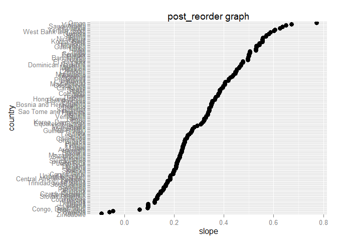

# HW5: Be the boss of my factors
Santina  
Thursday, October 16, 2014  

# Introduction 
In this assignment, we are going to see how to be in [control of factors](http://stat545-ubc.github.io/block014_factors.html) in a data set, using the provided [Gapminder excerpt](http://www.stat.ubc.ca/~jenny/notOcto/STAT545A/examples/gapminder/data/gapminderDataFiveYear.txt) as an example, and experiment with [reading and writing files](https://github.com/STAT545-UBC/STAT545-UBC.github.io/blob/master/cm011_files-out-in-script.r). 

It will follow roughly (with perhaps some experimentations on the side) the assignment guideline. This is the last assignment of STAT545! I can't wait for the second half of the course, which will be even more exciting! 

As always, let's get the gapminder data. Since it's from an URL, I am going to try to download it by reading it into R and saving it as a text file in my current directory. 

## Notes to myself 
Just some notes to remind me what I can use 
- writing to and reading from files
  * use `write.table()` and `read.delim()` or `read.table()`, make sure to experiment with different arguments 
- writing and reading R objects
  * RDS format: `saveRDS()`, `readRDS()`
  * plain text format (often preferable):`dput()` and `dget()` 

## same old stuff: packages and the gapminder data
load some packages 

```r
library(ggplot2) # for making plots
library(ggthemes)# for customizaing ggplot graphs 
library(scales)  # for graphs scale
library(plyr)    # for easy computation with data frames
library(dplyr)   # do this after loading plyr
library(knitr)   # for rendering pretty tables
```

Loading our gapminder data 

```r
gpURL <- "http://www.stat.ubc.ca/~jenny/notOcto/STAT545A/examples/gapminder/data/gapminderDataFiveYear.txt"
dataExcerpt <- read.delim(file = gpURL) 
str(dataExcerpt)
```

```
## 'data.frame':	1704 obs. of  6 variables:
##  $ country  : Factor w/ 142 levels "Afghanistan",..: 1 1 1 1 1 1 1 1 1 1 ...
##  $ year     : int  1952 1957 1962 1967 1972 1977 1982 1987 1992 1997 ...
##  $ pop      : num  8425333 9240934 10267083 11537966 13079460 ...
##  $ continent: Factor w/ 5 levels "Africa","Americas",..: 3 3 3 3 3 3 3 3 3 3 ...
##  $ lifeExp  : num  28.8 30.3 32 34 36.1 ...
##  $ gdpPercap: num  779 821 853 836 740 ...
```

```r
#saving it as "gapminder_excerpt.txt" in my current homework directory
write.table(dataExcerpt, "gapminder_excerpt.txt") 
```

Let's try to see how well we can read from the text file we just created. 

```r
gapExcerpt <-  read.delim(file = "gapminder_excerpt.txt")
str(gapExcerpt)
```

```
## 'data.frame':	1704 obs. of  1 variable:
##  $ country.year.pop.continent.lifeExp.gdpPercap: Factor w/ 1704 levels "1 Afghanistan 1952 8425333 Asia 28.801 779.4453145",..: 1 817 928 1039 1150 1261 1372 1483 1594 2 ...
```
Hum.... a little massier than the result of `str(dataExcerpt)`. Let's come back to this later. 

# Drop Oceania 
Since there are only two countries in this "continent" category, I will remove it and use `droplevels()` to ensure the level is completely clean of Oceania.


```r
# take everything except those whose continent is Oceania 
dataExcerpt2 <- dataExcerpt %>%
  filter(continent != "Oceania") %>%
  droplevels
# check if Oceania is dropped 
dataExcerpt2$continent %>%
  table()
```

```
## dataExcerpt2$continent
##   Africa Americas     Asia   Europe 
##      624      300      396      360
```

```r
# versus 
dataExcerpt$continent %>%
  table()
```

```
## dataExcerpt$continent
##   Africa Americas     Asia   Europe  Oceania 
##      624      300      396      360       24
```

Yes, so Oceania is no longer included in our data set `dataExcerpt2`. The number of rows in dataExcerpt is 1704 versus in the Oceania-dropped dataExcerpt is 1680. 


# life expectancy 

Let's look at the slopes of the life expectancy over years for each country. Using `~country + continent` we basically do this for every single country while retaining their continent identity (let me know if I can describe this better). 


```r
j_coefs <- ddply(dataExcerpt2, ~ country+continent, function(dat, offset = 1952) {
  the_fit <- lm(lifeExp ~ I(year - offset), dat)
  setNames(coef(the_fit), c("intercept", "slope"))
}) #this chunk was copied from the homework outline  

head(j_coefs) %>% kable()
```


|country     |continent | intercept|  slope|
|:-----------|:---------|---------:|------:|
|Afghanistan |Asia      |     29.91| 0.2753|
|Albania     |Europe    |     59.23| 0.3347|
|Algeria     |Africa    |     43.38| 0.5693|
|Angola      |Africa    |     32.13| 0.2093|
|Argentina   |Americas  |     62.69| 0.2317|
|Austria     |Europe    |     66.45| 0.2420|

Upon closer examination (with inline R code which you can't see unless you go to view raw), there are 4 columns, 140 rows. There are 140 unique countries and 4 unique continents.  

# Order of data vs order of factor levels 

Let's examine the differences among `post_arrange`, `post_reorder`, and `post_both`. 

```r
# code chunk below was copied/pasted from the assignment outline 
post_arrange <- j_coefs %>% arrange(slope)
post_reorder <- j_coefs %>%
  mutate(country = reorder(country, slope))
post_both <- j_coefs %>%
  mutate(country = reorder(country, slope)) %>%
  arrange(country)
```

## Use table to check
I am gonna first look at how each one is ordered. First, the original and followed by the three different tables.


```r
#see how j_coefs look 
j_coefs %>% head() %>% kable(format = "pandoc", caption = "The original: j_coefs")
```


Table: The original: j_coefs

country       continent    intercept    slope
------------  ----------  ----------  -------
Afghanistan   Asia             29.91   0.2753
Albania       Europe           59.23   0.3347
Algeria       Africa           43.38   0.5693
Angola        Africa           32.13   0.2093
Argentina     Americas         62.69   0.2317
Austria       Europe           66.45   0.2420

```r
#make a pretty table for post_arrange 
post_arrange %>% head() %>% kable(format = "pandoc", caption = "post_arrange")
```


Table: post_arrange

country            continent    intercept     slope
-----------------  ----------  ----------  --------
Zimbabwe           Africa           55.22   -0.0930
Zambia             Africa           47.66   -0.0604
Rwanda             Africa           42.74   -0.0458
Botswana           Africa           52.93    0.0607
Congo, Dem. Rep.   Africa           41.96    0.0939
Swaziland          Africa           46.39    0.0951

```r
#for other two as well: 
post_reorder %>% head() %>% kable(format = "pandoc", caption = "post_reorder")
```


Table: post_reorder

country       continent    intercept    slope
------------  ----------  ----------  -------
Afghanistan   Asia             29.91   0.2753
Albania       Europe           59.23   0.3347
Algeria       Africa           43.38   0.5693
Angola        Africa           32.13   0.2093
Argentina     Americas         62.69   0.2317
Austria       Europe           66.45   0.2420

```r
post_both %>% head() %>% kable(format = "pandoc", caption = "post_both")
```


Table: post_both

country            continent    intercept     slope
-----------------  ----------  ----------  --------
Zimbabwe           Africa           55.22   -0.0930
Zambia             Africa           47.66   -0.0604
Rwanda             Africa           42.74   -0.0458
Botswana           Africa           52.93    0.0607
Congo, Dem. Rep.   Africa           41.96    0.0939
Swaziland          Africa           46.39    0.0951

It looks like `post_arrange` and `post_both` are the same. Moreover, `post_reorder` looks the same to `j_coefs`, which is already ordered by country. Let's examine the end of the data just in case. 

```r
post_arrange %>% tail() %>% 
  kable(format = "pandoc", caption = "post_arrange: tail")
```


Table: post_arrange: tail

      country        continent    intercept    slope
----  -------------  ----------  ----------  -------
135   Yemen, Rep.    Asia             30.13   0.6055
136   Libya          Africa           42.10   0.6255
137   Indonesia      Asia             36.88   0.6346
138   Saudi Arabia   Asia             40.81   0.6496
139   Vietnam        Asia             39.01   0.6716
140   Oman           Asia             37.21   0.7722

```r
post_both %>% tail() %>% 
  kable(format = "pandoc", caption = "post_both: tail")
```


Table: post_both: tail

      country        continent    intercept    slope
----  -------------  ----------  ----------  -------
135   Yemen, Rep.    Asia             30.13   0.6055
136   Libya          Africa           42.10   0.6255
137   Indonesia      Asia             36.88   0.6346
138   Saudi Arabia   Asia             40.81   0.6496
139   Vietnam        Asia             39.01   0.6716
140   Oman           Asia             37.21   0.7722

##Use graphs to check
They look the same, however, double checking more 


```r
ggplot(post_arrange, aes(x=slope, y=country)) + geom_point(size=3) +
  ggtitle("post_arrange graph")
```

 

```r
ggplot(post_reorder, aes(x=slope, y=country)) + geom_point(size=3) +
  ggtitle("post_reorder graph")
```

 

```r
ggplot(post_both, aes(x=slope, y=country)) + geom_point(size=3) +
  ggtitle("post_both graph")
```

 

Now I finally understand!  For `post_arrange`, the table is simply organized by the values of slope. However, `post_reorder` has the part `country = reorder(country, slope)` which __order the country factor based on the slope__. The categorical variable, country, has its levels reordered based on the values of a second variable, slope. In the case of `post_both` the same factor arrangement is made, and the table is arrange by slope. That's why the tables for `post_both` and `post_arrange` look the same, though the produce different plots because one has its country factor organized to the slope, the other one doesn't. 

##the challenging questions
___If I swap out `arrange(country)` for `arrange(slope)` in `post_both`, what would I get?___ This is basically asking what the result would be if we add `arrange(slope)` to the code for `post_reorder`. I think you won't change the results of the plot nor the table because the levels of country factor are already reorderd based on the slopes. Since the countries are arranged by slopes, they will again be arranged by slopes as well.  


```r
post_both2 <- j_coefs %>%
  mutate(country = reorder(country, slope)) %>%
  arrange(slope)
post_both2 %>% head() %>% 
  kable(format = "pandoc", caption = "post_both2: head")
```


Table: post_both2: head

country            continent    intercept     slope
-----------------  ----------  ----------  --------
Zimbabwe           Africa           55.22   -0.0930
Zambia             Africa           47.66   -0.0604
Rwanda             Africa           42.74   -0.0458
Botswana           Africa           52.93    0.0607
Congo, Dem. Rep.   Africa           41.96    0.0939
Swaziland          Africa           46.39    0.0951
And indeed that's what we see.  

With this in mind, we can see that it'd make more sense to do `arrange()` first if we want to see real effects in the table, and then do `rearrange()` if we want to do certain modeling that requires certain factor levels to be ordered based on numeric variables. 

# Revalue a factor 
Hmmm...so let's add a new factor called "personality" to our data set. I will assign this to a subset of countries. 

```r
# get some of the countries
countries  <- c("Germany", "Canada", "Japan")
adjectives <- c("meticulous", "nice", "hard-working")
dataExcerpt3  <- dataExcerpt2 %>%
  filter(country %in% countries) %>%
  droplevels 
dataExcerpt3$country <- mapvalues(dataExcerpt3$country, countries, adjectives)
```

Now let's check if we have change the country factor levels

```r
str(dataExcerpt3)
```

'data.frame':	36 obs. of  6 variables:
 $ country  : Factor w/ 3 levels "nice","meticulous",..: 1 1 1 1 1 1 1 1 1 1 ...
 $ year     : int  1952 1957 1962 1967 1972 1977 1982 1987 1992 1997 ...
 $ pop      : num  14785584 17010154 18985849 20819767 22284500 ...
 $ continent: Factor w/ 3 levels "Americas","Asia",..: 1 1 1 1 1 1 1 1 1 1 ...
 $ lifeExp  : num  68.8 70 71.3 72.1 72.9 ...
 $ gdpPercap: num  11367 12490 13462 16077 18971 ...

```r
levels(dataExcerpt3$country)
```

[1] "nice"         "meticulous"   "hard-working"
Awesome! 

# Reorder a factor 

