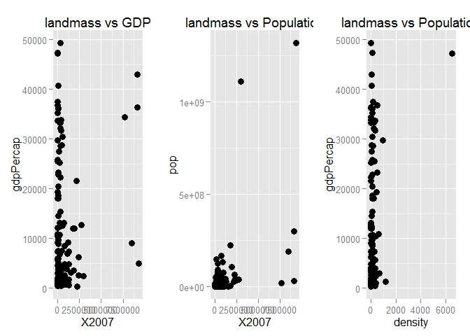

# HW7: Data wrangling Grand Finale
Santina  
Thursday, October 30, 2014  
# Intro 

So in this assignment we're going to "wrangle" data, i.e., using new methods  or combining with new methods such as `dplyr`, `plyr`, `tidyr`, `reshape2`. 

First, load some packages 

```r
library(ggplot2)    # for making plots
library(ggthemes)   # for customizaing ggplot graphs 
library(scales)     # for graphs scale
library(plyr)       # for easy computation with data frames
library(dplyr)      # do this after loading plyr
library(knitr)      # for rendering pretty tables
library(grid)
library(gridExtra)  # arranging graph
library(reshape2)
```

Then read in some data: 

```r
# our old gapminder country data: 
gdURL <- "http://tiny.cc/gapminder"
gapminder <- read.delim(file = gdURL) 
```

# Join, Merge, Look up 
For this part of the exercise, I looked at this [join cheatsheet](http://stat545-ubc.github.io/bit001_dplyr-cheatsheet.html) for ideas on how to join two data sets together to form a table.  

So for the exercise I'm going to merge our old gapminder data with [land area by country] (http://data.worldbank.org/indicator/AG.LND.TOTL.K2) from the world bank. 

I'm taking a minute to remind myself how to read csv: 


```r
land_mass  <- read.csv("land_area_country_year.csv", skip = 2, header = TRUE)
head(land_mass,1)
```

```
##   Country_Name Country_Code          Indicator           Code X1960 X1961
## 1        Aruba          ABW Land area (sq. km) AG.LND.TOTL.K2    NA   180
##   X1962 X1963 X1964 X1965 X1966 X1967 X1968 X1969 X1970 X1971 X1972 X1973
## 1   180   180   180   180   180   180   180   180   180   180   180   180
##   X1974 X1975 X1976 X1977 X1978 X1979 X1980 X1981 X1982 X1983 X1984 X1985
## 1   180   180   180   180   180   180   180   180   180   180   180   180
##   X1986 X1987 X1988 X1989 X1990 X1991 X1992 X1993 X1994 X1995 X1996 X1997
## 1   180   180   180   180   180   180   180   180   180   180   180   180
##   X1998 X1999 X2000 X2001 X2002 X2003 X2004 X2005 X2006 X2007 X2008 X2009
## 1   180   180   180   180   180   180   180   180   180   180   180   180
##   X2010 X2011 X2012 X2013
## 1   180   180   180   180
```
So we can see that this data frame has country for each row, and land mass in km^2 by year. Also, land mass probably doesn't change much with time. Just in case though, I will take the land mass of each country in one particular year, and try to match to GDP per capita per country in gapminder data. The aim is to see how GDP per capita relates to the landmass of a country. Does landmass contributes to more national wealth production? Does smaller countries have more GDP per capita or faster growth in wealth? This idea arises because I have seen places like Hong Kong and Taiwan, which are tiny, having large growth in GDP per capita. 

What about population? Does population depends heavily on the landmass? If we can put landmass and population together, we can easily calculate population density too! Wow, generating data from data. 

The latest year in gapminder is 2007. So I will subset `land_mass` to just that year and subset gapminder to just `country` and `gdpPercap`. 


```r
colnames(land_mass) 
```

```
##  [1] "Country_Name" "Country_Code" "Indicator"    "Code"        
##  [5] "X1960"        "X1961"        "X1962"        "X1963"       
##  [9] "X1964"        "X1965"        "X1966"        "X1967"       
## [13] "X1968"        "X1969"        "X1970"        "X1971"       
## [17] "X1972"        "X1973"        "X1974"        "X1975"       
## [21] "X1976"        "X1977"        "X1978"        "X1979"       
## [25] "X1980"        "X1981"        "X1982"        "X1983"       
## [29] "X1984"        "X1985"        "X1986"        "X1987"       
## [33] "X1988"        "X1989"        "X1990"        "X1991"       
## [37] "X1992"        "X1993"        "X1994"        "X1995"       
## [41] "X1996"        "X1997"        "X1998"        "X1999"       
## [45] "X2000"        "X2001"        "X2002"        "X2003"       
## [49] "X2004"        "X2005"        "X2006"        "X2007"       
## [53] "X2008"        "X2009"        "X2010"        "X2011"       
## [57] "X2012"        "X2013"
```

```r
colnames(gapminder)
```

```
## [1] "country"   "year"      "pop"       "continent" "lifeExp"   "gdpPercap"
```

Before subsetting and merging, we need to make sure the column names for the countries names.   

```r
# get index for "Country_Name" in the array of colnames
index  <- grep("Country_Name", colnames(land_mass))
# change the name to "country"
colnames(land_mass)[index] <- "country"
```

## Playing with joins 
Now let's try

```r
joinInner <- inner_join(
  gapminder[gapminder$year==2007, c("country", "gdpPercap", "pop")], 
  land_mass[, c("country", "X2007")])
```

```
## Joining by: "country"
```

```r
kable(head(joinInner))
```


|country     | gdpPercap|      pop|   X2007|
|:-----------|---------:|--------:|-------:|
|Afghanistan |     974.6| 31889923|  652230|
|Angola      |    4797.2| 12420476| 1246700|
|Albania     |    5937.0|  3600523|   27400|
|Argentina   |   12779.4| 40301927| 2736690|
|Australia   |   34435.4| 20434176| 7682300|
|Austria     |   36126.5|  8199783|   82450|

```r
nrow(joinInner) 
```

[1] 134

```r
nrow(gapminder[gapminder$year==2007,])
```

[1] 142

Finally! `inner_join` basically joins the data such that th first argument, our gapminder data, is the main character. The countries which have data inside `land_mass` are return. We can see that, not every country is returned by `inner_join`, because information about their landmass in that particular year doesn't exist in `land_mass`. 

To see what those missing countries are, we can use `anti_join`: 


```r
antiJoin <- anti_join(
  gapminder[gapminder$year==2007, c("country", "gdpPercap", "pop")], 
  land_mass[, c("country", "X2007")])
```

```
## Joining by: "country"
```

```r
kable(antiJoin)
```


|country          | gdpPercap|      pop|
|:----------------|---------:|--------:|
|Iran             |   11605.7| 69453570|
|Reunion          |    7670.1|   798094|
|Gambia           |     752.7|  1688359|
|Hong Kong, China |   39725.0|  6980412|
|Syria            |    4184.5| 19314747|
|Egypt            |    5581.2| 80264543|
|Taiwan           |   28718.3| 23174294|
|Venezuela        |   11415.8| 26084662|

```r
nrow(antiJoin)
```

[1] 8

## Population Density

Now let's calculate density 


```r
joinInner <- mutate(joinInner, density = pop/X2007)

kable(head(joinInner))
```


|country     | gdpPercap|      pop|   X2007| density|
|:-----------|---------:|--------:|-------:|-------:|
|Afghanistan |     974.6| 31889923|  652230|  48.894|
|Angola      |    4797.2| 12420476| 1246700|   9.963|
|Albania     |    5937.0|  3600523|   27400| 131.406|
|Argentina   |   12779.4| 40301927| 2736690|  14.726|
|Australia   |   34435.4| 20434176| 7682300|   2.660|
|Austria     |   36126.5|  8199783|   82450|  99.452|


## Relationship between variables
And then we can look at relationships between density and gdpPercap, population and landmass, etc. 


```r
landmass_GDP  <- 
  ggplot(joinInner, aes(x=X2007, y=gdpPercap)) + geom_point(size=3) +
  ggtitle("landmass vs GDP")


landmass_pop <- 
  ggplot(joinInner, aes(x=X2007, y=pop)) + geom_point(size=3) +
  ggtitle("landmass vs Population")

density_GDP <- 
  ggplot(joinInner, aes(x=density, y=gdpPercap)) + geom_point(size=3) +
  ggtitle("landmass vs Population")

grid.arrange(landmass_GDP, landmass_pop, density_GDP, ncol=3)
```

 

Hum, turn out that there aren't much relationship between each pair. But I guess that's part of data analysis. 

#Data aggregation based on lists and arrays 

So in this part of activity, I am going to explore various methods that have make for loop in R almost unnecessary. Namely, those `apply` methods in plyr package. Here's the [summary of the methods](http://www.slideshare.net/jenniferbryan5811/cm009-data-aggregation) that I should read first. It's very useful, I can't believe I never realize that a method name, such as `ddply` means putting a dataframe in and getting a dataframe out. Now I won't get them confused anymore. 

## dlply()
First, let's look at life expectancy by countries, as suggested in activity 1, and put into each linear model into a list: 

```r
linear_models <- dlply(gapminder, ~ country, function(data, offset = 1952) {
  the_fit <- lm(lifeExp ~ I(year - offset), data)
  setNames(coef(the_fit), c("intercept", "slope"))
}) #this chunk was copied from the homework5 and modified

class(linear_models)
```

```
## [1] "list"
```

```r
head(linear_models)
```

```
## $Afghanistan
## intercept     slope 
##   29.9073    0.2753 
## 
## $Albania
## intercept     slope 
##   59.2291    0.3347 
## 
## $Algeria
## intercept     slope 
##   43.3750    0.5693 
## 
## $Angola
## intercept     slope 
##   32.1267    0.2093 
## 
## $Argentina
## intercept     slope 
##   62.6884    0.2317 
## 
## $Australia
## intercept     slope 
##   68.4005    0.2277
```

```r
length(linear_models)
```

```
## [1] 142
```

We can see that now that the linear model for each country is now in a list, and there are 142 elements in the list because there are that many countries in gapminder. 

## ldply() 

We are going to pull things from the list `linear_models`. The output would be a data.frame. 

Pulling out the estimated coefficients so that output is a data.frame with one row per country: 


```r
country_models  <- ldply(linear_models, function(data){
  data
})
class(country_models) 
```

[1] "data.frame"

```r
# wow so easy
kable(head(country_models))
```


|country     | intercept|  slope|
|:-----------|---------:|------:|
|Afghanistan |     29.91| 0.2753|
|Albania     |     59.23| 0.3347|
|Algeria     |     43.38| 0.5693|
|Angola      |     32.13| 0.2093|
|Argentina   |     62.69| 0.2317|
|Australia   |     68.40| 0.2277|

Now we will pull out the information and return a dataframe such that there are two rows per country, with one row for intercept and one for slope. 


```r
country_models_compact  <- melt(country_models)
  # Using country as id variables
arrange(country_models_compact, country)
```


```r
class(country_models_compact)
```

```
## [1] "data.frame"
```

```r
head(country_models_compact)
```

```
##       country  variable value
## 1 Afghanistan intercept 29.91
## 2     Albania intercept 59.23
## 3     Algeria intercept 43.37
## 4      Angola intercept 32.13
## 5   Argentina intercept 62.69
## 6   Australia intercept 68.40
```
By using melt, we make the data frame we got earlier to consist of three columns, one for variables, and one for type of variables, and one for country. 

Now we want to output a dataframe in which there are 1952, 1957, 1962, 1967, 1972, 1977, 1982, 1987, 1992, 1997, 2002, 2007 rows for each country (i.e. all years) and have lifeExp, fitted and residual value for each of those years. 


```r
linear_models_info <- ddply(gapminder, ~ country, function(data, offset = 1952) {
  data <- data %>% group_by(year)
  the_fit <- lm(lifeExp ~ I(year - offset), data)
  setNames(the_fit$residuals, "residual")
  setNames(c(the_fit$residuals, the_fit$fitted,data$lifeExp),  c("resid","fitted", "lifeExp" ))
  #setNames(the_fit$fitted, "fitted")
  #setNames(data$lifeExp, "lifeExp")
  
}) 
head(linear_models_info)
```

```
##       country   resid  fitted lifeExp       NA      NA         NA      NA
## 1 Afghanistan -1.1063 -0.9519 -0.6636 -0.01722  0.6741  1.6474883  1.6868
## 2     Albania -3.9991 -1.6225  2.2440  1.97062  1.7672  1.3337914  1.1504
## 3     Algeria -0.2980 -0.5364 -0.7648 -0.50717 -0.2426  0.4070326  0.9146
## 4      Angola -2.1117 -1.1744 -0.2201  0.71825  1.6145  2.1228497  1.5352
## 5   Argentina -0.2034  0.5520  0.1365 -0.53006 -0.2576 -0.0001457  0.3023
## 6   Australia  0.7195  0.7909  0.2522 -0.71637 -1.0250 -0.6036072 -0.4922
##         NA       NA      NA       NA      NA    NA    NA    NA    NA    NA
## 1  1.27820  0.75356 -0.5341 -1.54473 -1.2224 29.91 31.28 32.66 34.04 35.41
## 2  1.05696 -1.03546 -1.3399 -0.31229 -1.2137 59.23 60.90 62.58 64.25 65.92
## 3  2.49924  1.59784  0.1594 -0.84496 -2.3844 43.37 46.22 49.07 51.91 54.76
## 4  0.45245  0.14675 -0.5839 -1.59065 -0.9093 32.13 33.17 34.22 35.27 36.31
## 5 -0.02423 -0.08877  0.1597  0.06614 -0.1124 62.69 63.85 65.01 66.16 67.32
## 6 -0.05084  0.05054  0.1819  0.58330  0.3097 68.40 69.54 70.68 71.82 72.95
##      NA    NA    NA    NA    NA    NA    NA    NA    NA    NA    NA    NA
## 1 36.79 38.17 39.54 40.92 42.30 43.67 45.05 28.80 30.33 32.00 34.02 36.09
## 2 67.60 69.27 70.94 72.62 74.29 75.96 77.64 55.23 59.28 64.82 66.22 67.69
## 3 57.61 60.45 63.30 66.15 68.99 71.84 74.69 43.08 45.69 48.30 51.41 54.52
## 4 37.36 38.41 39.45 40.50 41.55 42.59 43.64 30.02 32.00 34.00 35.98 37.93
## 5 68.48 69.64 70.80 71.96 73.12 74.27 75.43 62.48 64.40 65.14 65.63 67.06
## 6 74.09 75.23 76.37 77.51 78.65 79.79 80.93 69.12 70.33 70.93 71.10 71.93
##      NA    NA    NA    NA    NA    NA    NA
## 1 38.44 39.85 40.82 41.67 41.76 42.13 43.83
## 2 68.93 70.42 72.00 71.58 72.95 75.65 76.42
## 3 58.01 61.37 65.80 67.74 69.15 70.99 72.30
## 4 39.48 39.94 39.91 40.65 40.96 41.00 42.73
## 5 68.48 69.94 70.77 71.87 73.28 74.34 75.32
## 6 73.49 74.74 76.32 77.56 78.83 80.37 81.23
```

I spent quite a long time on this part and still can't figure out how to include the information about year in the dataframe. So far, it produces a data frame in which the last 12 columns are year (without label). I will come back to this, and would appreciate any insight. 

## Activity 2 
This part is about cutting and gluing back the data toghther. First we will chop the data by countries and write them to separate text files. 


```r
country_writing  <- ddply(gapminder, ~ country, function(data){
  country_data  <- data %>%
    filter(country == country) %>%
    droplevels() # drop country levels that aren't the country of interest
  
# first need to create the folder "countrylist"
write.table(country_data, 
            file = paste0("countrylist/", 
                          levels(country_data$country), 
                          ".tsv"), 
            sep = ",", row.names = FALSE)
})
```

Some verification if this was successful: 


```r
head(list.files("countrylist"))
```

```
## [1] "Afghanistan.tsv" "Albania.tsv"     "Algeria.tsv"     "Angola.tsv"     
## [5] "Argentina.tsv"   "Australia.tsv"
```

```r
a_country  <- read.delim(file=paste0("countrylist/", list.files("countrylist")[1]))
head(a_country)
```

```
##        country.year.pop.continent.lifeExp.gdpPercap
## 1  Afghanistan,1952,8425333,Asia,28.801,779.4453145
## 2  Afghanistan,1957,9240934,Asia,30.332,820.8530296
## 3   Afghanistan,1962,10267083,Asia,31.997,853.10071
## 4  Afghanistan,1967,11537966,Asia,34.02,836.1971382
## 5 Afghanistan,1972,13079460,Asia,36.088,739.9811058
## 6   Afghanistan,1977,14880372,Asia,38.438,786.11336
```

```r
class(a_country)
```

```
## [1] "data.frame"
```
So that was successful! 


```r
files  <- list.files("countrylist",  full.names = TRUE)
bigFile  <- adply(files, .margin = 1, function(data){
  read.delim(file = data) 
})

head(bigFile)
```

```
##   X1      country.year.pop.continent.lifeExp.gdpPercap
## 1  1  Afghanistan,1952,8425333,Asia,28.801,779.4453145
## 2  1  Afghanistan,1957,9240934,Asia,30.332,820.8530296
## 3  1   Afghanistan,1962,10267083,Asia,31.997,853.10071
## 4  1  Afghanistan,1967,11537966,Asia,34.02,836.1971382
## 5  1 Afghanistan,1972,13079460,Asia,36.088,739.9811058
## 6  1   Afghanistan,1977,14880372,Asia,38.438,786.11336
```
So that was successful! Notice that we need `full.names = TRUE` because our current directory is one level above the `countrylist` folder. 

Now let's try getting the number of rows from each file, using aaply so that we get a list of number of rows. 

```r
infoList  <- aaply(files, .margin = 1, function(data){
  file  <- read.delim(file = data, header = TRUE, sep = ",")
  nrows  <- nrow(file)
  #names(nrows)  <-  levels(file$country)
})
head(infoList)
```

```
##  1  2  3  4  5  6 
## 12 12 12 12 12 12
```

The array shows that each file has 12 rows, but we don't know which country it is because each element is simply indexed. I tried naming the element inside this aaply without success. I guess it's because each element inside aaply is still a element, not an array. So I can't do it that way. 

I can't think of a smarter way to do this, so I will use aaply again to get an array of country names, and assign that to `infoList`. 


```r
country_names <- aaply(files, .margin = 1, function(data){
  file  <- read.delim(file = data, header = TRUE, sep = ",")  
  levels(file$country)
})
names(infoList)  <- country_names 
head(infoList)
```

```
## Afghanistan     Albania     Algeria      Angola   Argentina   Australia 
##          12          12          12          12          12          12
```
Now that works! 

Now we are going to try reading each files back and fit a linear model of life expectancy against time. We can use `alply` for this purpose. 


```r
lifeExpList <- alply(files, .margin = 1, function(data, offset = 1952){
  file  <- read.delim(file = data, header = TRUE, sep = ",")  
  the_fit <- lm(file$lifeExp ~ I(file$year - offset), file)
  setNames(coef(the_fit), c("intercept", "slope"))
})

head(lifeExpList)
```

```
## $`1`
## intercept     slope 
##   29.9073    0.2753 
## 
## $`2`
## intercept     slope 
##   59.2291    0.3347 
## 
## $`3`
## intercept     slope 
##   43.3750    0.5693 
## 
## $`4`
## intercept     slope 
##   32.1267    0.2093 
## 
## $`5`
## intercept     slope 
##   62.6884    0.2317 
## 
## $`6`
## intercept     slope 
##   68.4005    0.2277
```

```r
names(lifeExpList)  <- country_names
head(lifeExpList)
```

```
## $Afghanistan
## intercept     slope 
##   29.9073    0.2753 
## 
## $Albania
## intercept     slope 
##   59.2291    0.3347 
## 
## $Algeria
## intercept     slope 
##   43.3750    0.5693 
## 
## $Angola
## intercept     slope 
##   32.1267    0.2093 
## 
## $Argentina
## intercept     slope 
##   62.6884    0.2317 
## 
## $Australia
## intercept     slope 
##   68.4005    0.2277
```

Yay we did it. Notice that we set the names of the list again. The procedures here are similar to how we get a table of linear model for each country with `ddply`, with just some minor differences. Since we're reading each file in a file list, instead of reading gapminder by country chunk, so we specify which lifeExp and which year the data is coming from. 

Now we will try to graph life expectancy over year for each country, and we will store the graph as a `jpg` into the `countrylist` folder. 


```r
lifeExpList <- a_ply(files, .margin = 1, function(data){
  file  <- read.delim(file = data, header = TRUE, sep = ",")  
  
  #set up important names
  file_name  <- paste0("countrylist/",levels(file$country),".jpg")
  graph_title <- paste0(levels(file$country), ": life expectancy over year")
  

  #jpeg(file_name)
  graph <- ggplot(file, aes(x=year, y=lifeExp)) + geom_point(size=3) +
  ggtitle(graph_title)

  dev.copy(jpeg,filename=file_name)
  dev.off()
  
})
```

Now let's check if files are there. 


```r
files  <- list.files("countrylist", full.name = TRUE)
jpg_files <-  grep("jpg$", files, value = TRUE) 
head(jpg_files)
```

```
## [1] "countrylist/Afghanistan.jpg" "countrylist/Albania.jpg"    
## [3] "countrylist/Algeria.jpg"     "countrylist/Angola.jpg"     
## [5] "countrylist/Argentina.jpg"   "countrylist/Australia.jpg"
```

Yay there are there! 

# reflection 

I think the plyr part was the most difficult. I often couldn't wrap my head around not using for loop and having a function magically produce a list/array/dataframe of things for me. Still, I have gotten a hang of how to do this, and thought it's really cool that you can create files on the fly like this. I wish I know R earlier... I couldn't have automate analyzing a large set of data like this!  I'm also really glad I get to pull my knowledge, old and new, together in this assignment, such as using `paste0()` to make unique file names and regular expression to read specific set of files.

