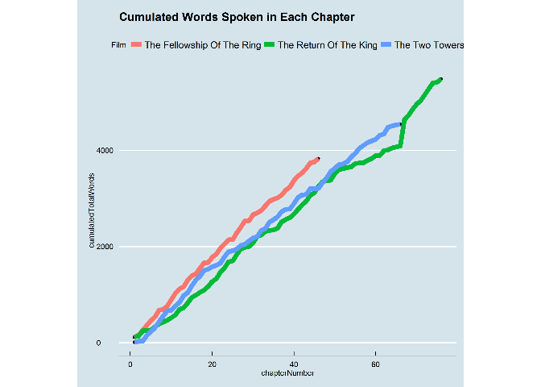

# Lord of the Ring: a Film Critique
Santina  
Sunday, November 16, 2014  

# The purpose 

This .Rmd will serves as a little README file to document the purpose of this assignment, as well as my struggles and eventual success on this work. 

The purpose was to make a pipeline. With the [instruction of the assignment](http://stat545-ubc.github.io/hw09_automation.html) and [examples](https://github.com/STAT545-UBC/STAT545-UBC.github.io/tree/master/automation10_holding-area/02_automation-example_r-and-make), especially with the [in-class tutorial led by Shawn](http://stat545-ubc.github.io/cm105_pipelines.html) it wasn't too bad. 

All I needed was to follow the [Makefile example](https://github.com/STAT545-UBC/zz_sheng-ting_lin-coursework/tree/master/Make_experiment) I wrote in class and it was alright. 

However, things to note for myself: 
- make sure you set your build directory at your current directory.
  * it by default automatically sets to your root project directory
- double check dependcy all the time 


# Pipeline explained 
Makefile is really clear, but in details: 
The end result is the html rendered from the markdown. 

Clear would remove intermediate files, and those are the raw data of lord of the ring data downloaded from the web, the tsv file I made (with cumulated spoken words), and the figure. It also deletes report.md and report.html which would be regenerated with build by rendering report.Rmd.  

Dependency of each R script depends on what kind of data it relies on. For example, analysis.R requires the lord of the ring data to be available in the directory.

`$<` means the first target. 


# The graph I made! 

```r
library(png)
```

```
## Warning: package 'png' was built under R version 3.1.2
```

```r
library(grid)
graph <- readPNG("CumulatedWordsSpoken.png")
 grid.raster(graph)
```

 

If the length of the content nicely correlates with the spoken words by the main characters, the nearly straight lines in this graph shows that Tolkien evenly sectioned his books into chapters. Moreover, we can see that Book 1 of LOR, __The Fellowship of the Ring__ is the shortest among the trilogy, whereas the last book is the longest. Tolkien probably gets more and more fond of writing, with the story unfolds and each event leads to more events and poetic songs (I'm a huge fan). 

Though it might not seemed super impressive, it took me a long time to prepare this graph. I used so many methods I had not used before. 

Calculating cumulative spoken words was a challenge until I found out about `cumsum`. Problems with writing and reading files, due to the existance of `,` inside some names of the chapters gave me headache too. Merging different data frames to create `analysis.tsv` also took me a long time to figure out, pulling techniques from data joint and family of apply functions. 


# Reflection 
The Makefile part was really fun. It actually helped a lot with the actual analysis part because it ensures that I have no files lying around. I think I might start doing assignments in such a way, because this pipeline method seems very structured and help me organized myself. 

I spent a lot of time debugging things have to do with data frame. However, it was great that I used some new functions, including `cumsum()`, `inner_join()`, `tapply()` etc. More notes to myself
- always check if things are factors when they're supposed to, or numbers are numeric (in case they get turned into factors somehow)
- arguments in write.table() and read.table() are super important. 
  * choose your deliminater wisely, it all depends on the text in the data 
